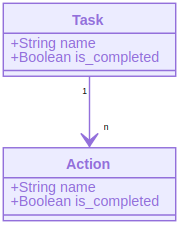

# TODO
Todo list monorepo (backend-python / frontend-react)

## Backend

Backend was made using [FastAPI](https://fastapi.tiangolo.com/).

### Data modeling
Modeling was preety straigth foward, and task can cointan multiple actions, which one can be completed individually.




## Frontend

Run locally, it will point to the hosted backend in cloud

```
git clone https://github.com/Jonatha-Varjao/TODO.git
cd front 
yarn 
yarn start
```


